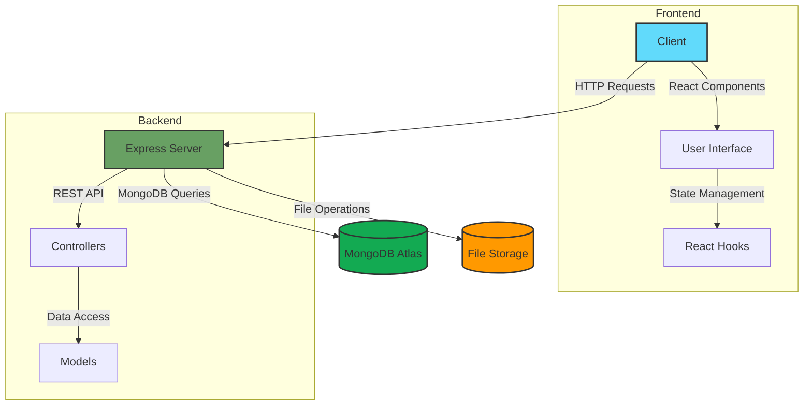

# Bits and Volts User Management System

A comprehensive user management application built with the MERN stack (MongoDB, Express.js, React.js, Node.js). This application provides full CRUD functionality, search, pagination, CSV export, and a responsive UI.

## 🏗️ Project Architecture



## 📁 Project Structure

```
bits-and-volts-user-management/
├── client/                    # React frontend
│   ├── public/               # Static files
│   ├── src/
│   │   ├── assets/           # Images, fonts, etc.
│   │   ├── components/       # Reusable UI components
│   │   │   ├── feedback/     # Notification components
│   │   │   ├── layout/       # Layout components
│   │   │   └── users/        # User-related components
│   │   ├── pages/            # Page components
│   │   ├── services/         # API service layer
│   │   ├── App.jsx           # Main App component
│   │   └── main.jsx          # Entry point
│   ├── .env.example          # Environment variables example
│   └── package.json          # Frontend dependencies
│
├── server/                   # Node.js/Express backend
│   ├── src/
│   │   ├── config/          # Configuration files
│   │   ├── controllers/     # Request handlers
│   │   ├── middleware/      # Custom middleware
│   │   ├── models/          # Database models
│   │   ├── routes/          # API routes
│   │   └── index.js         # Server entry point
│   ├── .env.example         # Environment variables example
│   ├── package.json         # Backend dependencies
│   └── uploads/             # File uploads (not versioned)
│
├── .gitignore
├── README.md                # This file
└── package.json             # Root package.json (optional)
```

### Key Features

- **Frontend (React)**
  - Modern, responsive UI with Material-UI components
  - Form validation and error handling
  - Client-side routing with React Router
  - State management with React Hooks
  - CSV export functionality

- **Backend (Node.js/Express)**
  - RESTful API design
  - JWT authentication (if implemented)
  - File upload handling with Multer
  - MongoDB integration with Mongoose
  - Error handling middleware
  - Request validation

- **Database (MongoDB)**
  - Flexible schema design
  - Indexed queries for better performance
  - Data validation at the model level

### Prerequisites

- Node.js (LTS recommended)
- npm
- MongoDB running locally or in the cloud

### Backend setup (`server`)

1. Go to the backend folder:

   ```bash
   cd server
   ```

2. Create a `.env` file based on `.env.example`:

   ```bash
   cp .env.example .env
   ```

   Update values as needed:

   - `MONGODB_URI` – your MongoDB connection string
   - `PORT` – API port (default `5000`)
   - `CLIENT_ORIGIN` – frontend origin (default `http://localhost:5173`)

3. Install dependencies (already done if using the provided zip, but safe to run):

   ```bash
   npm install
   ```

4. Start the backend:

   ```bash
   npm run dev
   ```

   The API will be available at `http://localhost:5000`.

   Useful endpoints:

   - `GET /api/health` – health check
   - `GET /api/users` – list with `page`, `limit`, `search`
   - `POST /api/users` – create user (multipart/form-data)
   - `PUT /api/users/:id` – update user (multipart/form-data)
   - `DELETE /api/users/:id` – delete user
   - `GET /api/users/export` – download CSV (supports `search` query)

### Frontend setup (`client`)

1. Go to the frontend folder:

   ```bash
   cd client
   ```

2. Create a `.env` file based on `.env.example`:

   ```bash
   cp .env.example .env
   ```

   - `VITE_API_BASE_URL` should point to the backend base URL (e.g. `http://localhost:5000`).

3. Install dependencies:

   ```bash
   npm install
   ```

4. Start the frontend dev server:

   ```bash
   npm run dev
   ```

   Open the URL printed in the terminal (usually `http://localhost:5173`).

### Frontend features

- **List page**
  - Search box and button
  - Table with pagination
  - Actions menu per row: View, Edit, Delete
  - Export to CSV button (honors search filter)
  - Add User button opens the form page

- **Add/Edit form page**
  - Validates required fields, email format, and 10-digit mobile
  - Radio buttons for gender, dropdown for status
  - File upload for profile picture
  - On success, shows a notification and navigates back to the list

- **View details page**
  - Card-style layout with avatar, status chip, and all details
  - Uses the uploaded profile image if available

### Deployment notes

You can deploy the app using any hosting providers, for example:

- **Backend**
  - Render, Railway, or similar Node.js hosting
  - Set environment variables (`MONGODB_URI`, `PORT`, `CLIENT_ORIGIN`)
  - Configure the start command: `npm start`

- **Frontend**
  - Netlify, Vercel, or any static hosting
  - Build command: `npm run build`
  - Publish directory: `dist`
  - Set environment variable `VITE_API_BASE_URL` to your deployed backend URL

After deployment, confirm:

1. The frontend URL is accessible.
2. Creating/editing/deleting users works end-to-end.
3. Search, pagination, and CSV export behave as expected.

